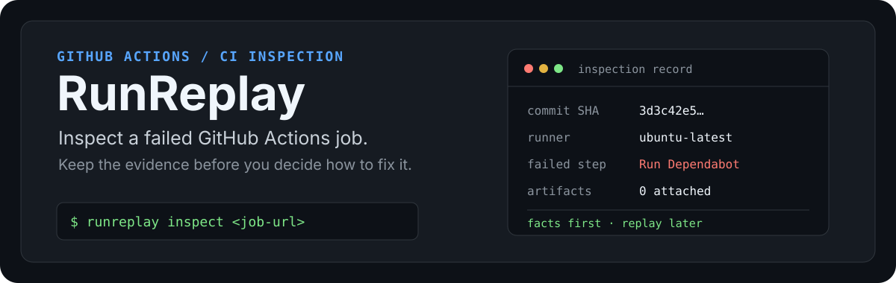

<p align="center">
  
</p>

<p align="center">
  <a href="https://github.com/shleder/runreplay/actions/workflows/ci.yml"></a>
  <a href="https://github.com/shleder/runreplay/releases"></a>
  <a href="./LICENSE"></a>
</p>

<p align="center">
  <strong>Inspect any GitHub Actions job from your terminal.</strong><br>
  Turn a job URL into the facts a maintainer needs before attempting a fix.
</p>

<p align="center">
  <a href="#quick-start">Quick start</a> ·
  <a href="#what-you-get">What you get</a> ·
  <a href="#compare-a-failure-with-its-baseline">Compare</a> ·
  <a href="#machine-readable-output">JSON output</a> ·
  <a href="./ROADMAP.md">Roadmap</a> ·
  <a href="./CONTRIBUTING.md">Contributing</a>
</p>

## Start with the failed job

```bash
npx runreplay inspect https://github.com/OWNER/REPO/actions/runs/RUN_ID/job/JOB_ID

# Resolve the workflow source and Action revisions for the same historical job
npx runreplay resolve https://github.com/OWNER/REPO/actions/runs/RUN_ID/job/JOB_ID

# Compare a failed job with the last strictly comparable successful job
npx runreplay compare https://github.com/OWNER/REPO/actions/runs/RUN_ID/job/JOB_ID --baseline last-successful
```

`npx` downloads the public CLI when needed; no clone or global install is required. RunReplay works without a token for public repositories, subject to GitHub's anonymous API limits. For private repositories, set a fine-grained `GITHUB_TOKEN` with read access to **Actions** and **Contents**:

```bash
GITHUB_TOKEN=github_pat_... npx runreplay inspect <job-url>
```

Do not paste tokens into an issue, shared shell history, or CI log.

To install it once instead:

```bash
npm install --global runreplay
runreplay inspect <job-url>
```

## See the inspection

This is a real inspection of a public failed GitHub Actions job. RunReplay identifies the commit, hosted runner, failed step, and attached artifacts before anyone proposes a patch.

<p align="center">
  <a href="https://github.com/shleder/runreplay/releases/tag/v0.1.0">
    
  </a>
</p>

## What you get

| Evidence | Why it matters |
| --- | --- |
| Commit SHA and branch | Anchor the investigation to the code that actually ran. |
| Workflow event and job conclusion | Separate a failing job from a broader workflow summary. |
| Runner labels and timing | Show the available execution context GitHub exposes. |
| Per-step results | Point directly to the failed command stage. |
| Logs API URL and artifacts | Preserve the available trail for deeper investigation. |

## Machine-readable output

Use `--json` when the inspection feeds Claude, `jq`, a CI bot, or another tool:

```bash
node dist/cli.js inspect <job-url> --json > inspection.json
```

The public schema is versioned from day one:

```json
{
  "schemaVersion": "1.0",
  "repository": "actions/checkout",
  "runId": 123,
  "jobId": 456,
  "commitSha": "…",
  "event": "push",
  "runner": { "labels": ["ubuntu-latest"] },
  "steps": [],
  "artifacts": [],
  "redactions": []
}
```

## Resolve manifest: what actually ran

`inspect` tells you what GitHub still exposes about a job. `resolve` adds the workflow source from the **commit that ran** and identifies the revision behind each supported `uses:` declaration:

```bash
npx runreplay resolve <job-url> --json > manifest.json
```

RunReplay never resolves a mutable tag today and calls it historical truth. Every Action record declares its evidence level:

| Evidence | Meaning |
| --- | --- |
| `runtime-log` | GitHub Runner recorded the exact SHA downloaded by this job. This is the strongest historical evidence. |
| `declared-full-sha` | The workflow declared an immutable 40-character SHA. |
| `github-api-current-ref` | GitHub resolved a mutable branch or tag now. It is useful context, not proof of the old run. |
| `unresolved` | RunReplay lacks trustworthy evidence and says why instead of guessing. |

Version 0.2 supports repository Actions, including actions declared from repository subdirectories. It explicitly reports local Actions, Docker Actions, dynamic expressions, and reusable workflows as unresolved where their execution cannot yet be proven.

## Compare a failure with its baseline

`compare` turns two historical jobs into a CI diff. It reports changes in workflow source, declared and historically observed Action revisions, runner labels, steps, artifacts, timing, commits, and changed files.

```bash
# Explicit baseline: first URL is the failed/target job, second is its baseline
npx runreplay compare <failed-job-url> <baseline-job-url>

# Automatic baseline: only an exact earlier successful match is accepted
npx runreplay compare <failed-job-url> --baseline last-successful

# Stable machine-readable report
npx runreplay compare <failed-job-url> --baseline last-successful --json > comparison.json
```

For `last-successful`, RunReplay requires the same repository workflow, job name, event, branch, and runner labels. If no such completed successful job exists, it returns:

```json
{
  "schemaVersion": "1.0",
  "baseline": null,
  "reason": "no-comparable-successful-job"
}
```

`changedInputs` is deliberately descriptive, not an AI diagnosis: a changed Action SHA or runner image is an investigation lead, not proof of the failure's cause.

## Scope: facts first, replay later

RunReplay is an **inspector**, not a VM time machine. It does not claim to restore a completed runner's filesystem, caches, secrets, service-container state, or other data GitHub did not retain.

The resolve manifest finds the workflow source at the inspected commit and identifies supported Action revisions with explicit evidence. Matrix expansion, reusable workflow traversal, nested/composite Actions, and a best-effort local replay path remain future work. Every replay claim must be backed by explicit evidence and verification. See [the roadmap](./ROADMAP.md).

## Architecture

```text
job URL
  │
  ├── URL parser ── validates owner, repository, run, and job IDs
  ├── GitHub API ── retrieves job, workflow run, and artifact metadata
  ├── inspection ── formats evidence for humans or the versioned JSON schema
  └── resolve manifest ── historical workflow source + Action SHA evidence
      └── compare ── strict baseline matching + factual CI diff
```

## Contribute

The first public contribution paths are intentionally small and useful:

- [recorded GitHub API fixtures](https://github.com/shleder/runreplay/issues/1);
- [clearer authentication and rate-limit errors](https://github.com/shleder/runreplay/issues/2);
- [GitHub Enterprise Server job URL support](https://github.com/shleder/runreplay/issues/3).

Read [CONTRIBUTING.md](./CONTRIBUTING.md), run the checks, and keep each pull request focused.

```bash
git clone https://github.com/shleder/runreplay.git
cd runreplay
npm install
npm test
npm run check
```

## License

[Apache-2.0](./LICENSE)
